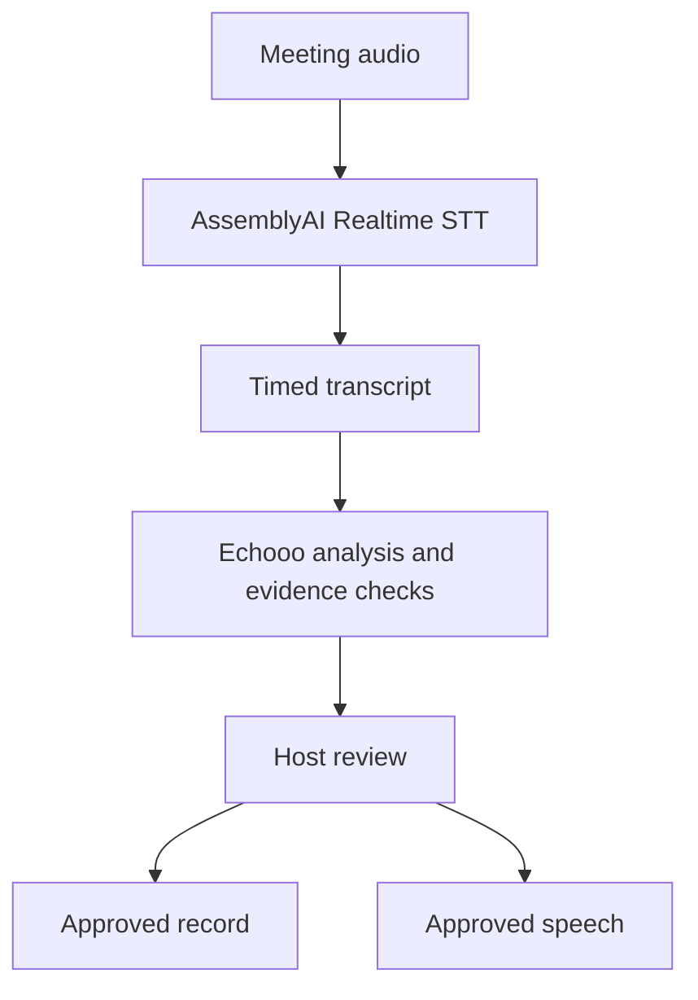

<p align="center"></p>

<h1 align="center">Echooo</h1>

<p align="center"><strong>A meeting voice agent that turns conversation into an evidence-backed record, with the host in control.</strong></p>

<h3 align="center"><a href="https://echooo.jastcraft.com/">▶ Open the live demo →</a></h3>

<p align="center"><a href="https://lablab.ai/ai-hackathons/assemblyai-voice-agent-hackathon">AssemblyAI Voice Agent Hackathon</a></p>

## Hackathon at a glance

### Problem and solution

Meeting notes can lose decisions, owners, and the words behind them. Echooo links proposed outcomes to timed transcript passages. The host reviews each finding before it enters the final record.

### AssemblyAI integration

Echooo streams audio to **AssemblyAI Realtime Speech-to-Text** over WebSocket. The transcript includes timing and speaker labels when available; saved audio can receive a later transcription check. Echooo handles analysis, review, and speech orchestration around AssemblyAI's Realtime STT API.

### Features built for the hackathon

- Evidence-linked decisions, action items, questions, contradictions, and risks, with edit, approve, reject, and review history.
- Private suggestions for material gaps. The host approves the exact wording before proactive speech; Echooo checks that the question is still relevant.
- Live browser recording and transcript, speaker correction, and a host-approved meeting record. Optional online participation uses self-hosted [Attendee](docs/ATTENDEE.md).

### Final demo and testing flow

Request dedicated account credentials for the [demo](https://echooo.jastcraft.com/) privately. Server operators can [provision an independent judge/demo workspace](docs/DEPLOYMENT.md#add-a-judgedemo-account). Use desktop Chrome, a microphone, and speakers or headphones; tell participants before recording.

1. **Record:** Open **Meetings → New meeting** and start **Microphone only**. For a remote meeting, choose **Tab + microphone** and enable **Share tab audio**.
2. **Inspect:** Discuss a decision, an assigned action, and an unresolved detail. Check the live transcript and source passages in **Review**.
3. **Approve:** Edit, approve, and reject findings. Check the confirmed record in **Summary & notes**.
4. **Speak and verify:** If **Suggested questions** finds a material gap, review it and choose **Play locally**. Stop recording, reload, and check the saved transcript and reviews.

Suggestions depend on the discussion and may not appear for a resolved issue. Online bot speech also needs Attendee and server TTS.

### Architecture and technology



| Layer | Technology / API |
| --- | --- |
| Browser | JavaScript, Web Audio / AudioWorklet, browser speech synthesis |
| Server and analysis | Python, FastAPI, WebSockets, Server-Sent Events, configurable OpenAI-compatible LLM API |
| Speech | AssemblyAI Realtime STT; optional AssemblyAI post-recording transcription and DashScope/CosyVoice TTS |
| Storage and hosting | SQLAlchemy, SQLite or PostgreSQL, Docker |

The model proposes findings; the host approves the record and proactive speech separately. See [Architecture](docs/ARCHITECTURE.md) and [governed participation](docs/MILESTONE_2.md) for details.

### Team

- **Fahmi Al Mughairy — product:** scope, host-control rules, scenarios, UX review, story, presentation, and submission.
- **Zilong — engineering:** AssemblyAI integration, analysis and evidence flow, frontend, deployment, and tests.

### Known limitations

- AI findings and speaker labels need human review.
- Browser recordings last up to 30 minutes each.
- Tab capture records only the selected tab.

## Run locally

Requires **Python 3.11+** and a modern browser with AudioWorklet support.

```bash
git clone https://github.com/jastfkjg/Echooo.git
cd Echooo
git checkout Milestone2
./start.sh --mock
```

Open [localhost:8000](http://127.0.0.1:8000) and create local workspace credentials. Mock mode supports text testing but does not transcribe audio. The launcher installs dependencies and creates `.env` from `.env.mock.example` if needed.

For live voice, configure `.env` using [.env.example](.env.example), then run `./start.sh` without `--mock`. Set `STT_PROVIDER=assemblyai` and `ASSEMBLYAI_API_KEY`; set `LLM_PROVIDER=openai_compatible`, `LLM_BASE_URL`, `LLM_MODEL`, and `LLM_API_KEY`. The LLM endpoint must stream `/chat/completions` and follow structured JSON instructions. Keep keys out of version control. See [Operations](docs/OPERATIONS.md) for other settings.

## Tests and deployment

```bash
STT_PROVIDER=mock LLM_PROVIDER=mock TTS_PROVIDER=browser .venv/bin/python -m pytest -q
node --test tests/*.mjs
```

Automated tests use simulated providers; complete the demo flow with real audio and live providers. See [Deployment](docs/DEPLOYMENT.md) for cloud setup and backups. Deployment is triggered manually through GitHub Actions.
