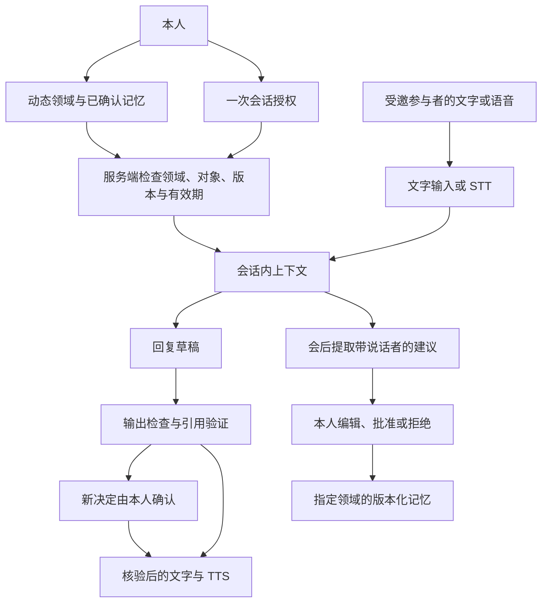

# 架构与信息边界

## 产品模型

领域是用户管理的数据对象，不是写在代码中的枚举。每条原始资料、记忆和记忆建议有一个领域。用户可以同时开启多个领域，但每次会话必须明确指定一个写入领域；单领域项目讨论只读写该领域。

## 四种权限

| 权限 | 当前实现 |
| --- | --- |
| read | 所选领域内逐条选择的有效记忆；私人会话可使用这些记忆 |
| disclose | read 的子集，必须标为可披露且对象匹配；**委托回复模型只接收这个子集** |
| act | `ask`：新承诺等待本人确认；`none`：只交流信息，不受理决定 |
| write | 一个选定领域，加独立学习开关；只生成待审核建议，审核后落库 |

`read` 中未选 `disclose` 的私人信息不会进入对外模型。这一版尚未实现利用私人底价进行内部推理的第二个决策代理；不会因为有读取权限就把底价交给对外模型。交流对象是本人填写的授权标签，不是自动验证的组织身份；邀请是持有即可兑换的凭证，应由本人交给指定对象。

会话创建后，领域、所选记忆、对象、有效期、写入目标和行动策略固定。知识版本存入授权快照。编辑已选记忆或领域会撤销活动会话；到期、删除和撤销也会中止回复及播放。扩大范围需新建会话。

## 代码职责

| 文件 | 责任 |
| --- | --- |
| `database.py` | 持久化表、owner 范围仓库、PostgreSQL RLS |
| `auth.py` | 密码验证、散列凭证、一次性邀请、过期与撤销 |
| `contracts.py` | 严格输入校验；禁止传入额外权限字段 |
| `service.py` | 领域、记忆、授权、回复、承诺审批、学习与删除规则 |
| `intelligence.py` | 授权集内检索、模型调用、草稿检查、只读记忆提取 |
| `rooms.py` | WebSocket 身份复核、STT、打断、核验后的语音输出 |
| `ingestion.py` | 有上限的文件文字提取，无自动远程抓取 |
| `app.py` | HTTP / WebSocket 入口、同源限制、静态界面 |
| `web/app.js`、`web/voice.js` | 本人与访客界面、显式录音与播放 |

所有浏览器路径共享 Service 的权限判断。模型没有数据库连接、动态 SQL、任意领域查询、文件系统和外部副作用工具。模型只返回结构化建议，不能签发授权。

## 身份和存储隔离

- 本版是单所有者部署，首次设置后不开放注册。底层表仍有 owner_id，仓库始终按验证后的身份筛选。
- owner 与 guest 使用独立 HttpOnly、SameSite=Strict cookie；数据库只保存随机 token 的 SHA-256 散列。密码使用 scrypt。邀请通过 URL fragment 传递，页面加载后移除 fragment，兑换时原 token 被原子消费。
- 访客凭证绑定一个会话；不开放 owner API、领域列表、私人笔记、授权细节或其他房间。重新发放邀请使原访客凭证失效。
- PostgreSQL 应用数据事务切换到无登录、无 BYPASSRLS 的 `echooo_scoped` 角色；RLS 用可信 owner 范围限制读取和写入。SQLite 则依赖服务端仓库与权限检查。
- RLS 当前是 **owner 级**，领域和披露是 Service 的显式检查。初始化 / 认证连接保有较高权限。数据库管理者、服务器管理员或应用进程完全失陷不在此边界内；生产强化需要独立迁移与运行账号。
- HTTP 变更请求和 WebSocket 检查来源；响应禁止缓存并设 CSP。没有跨站开放的 CORS 接口。开发时的非浏览器 API 客户端可省略 Origin，但仍需有效凭证。

## 回复路径

1. 复核调用者凭证及活动授权；HTTP 和 WebSocket 都执行。
2. 只取本次所选且有效的事实。委托使用 disclose 集；私人会话使用 read 集。私人旁听笔记不进入回复上下文。
3. 在已授权集合内按词项相关度排序；真实模型最多接收 12 条、合计约 36,000 字符的记忆，附最近 12 条当前会话消息。小规模事实同时保留没有字面重合的候选，由模型理解同义表达。**目前没有向量索引或跨领域语义搜索**。
4. 生成 JSON 草稿，校验结构和引用。委托额外调用检查器；不允许、格式错误、未知引用或服务失败时输出有限说明，不透出供应商错误、密钥或请求上下文。
5. 新承诺进入本人确认；审批采用一次性状态更新。本人提供发送给对方的确切文字。
6. 在模型返回后再次复核授权和调用者凭证，防止生成期间到期、撤销或轮换邀请。
7. 只发布已检查文本，随后播放。打断取消当前生成或合成；活动连接另有周期复核，音频块发送前也复核权限。

数据库与输入上下文的范围限制是确定性的；模型的事实归因、隐含承诺识别和输出检查具有误判可能。不能据此承诺“绝对不泄露”。参与者在当前会话中主动提供的内容、本人写入交流目标或审批文案的信息，也可能进入对话上下文。因此目标输入明确提示不填写秘密，私人监督笔记独立保存。

## 学习与更正

原始文件先存为领域内的来源；提取只创建 pending 建议。会话学习在正常结束后发生，带说话者和证据 ID。撤销会话不自动学习；本人私人旁听笔记、助手自己的回答都不作为新记忆的证据。客户的请求会保留“客户表示”的归属，不直接变成本人的承诺。

批准时可编辑标题、内容、披露范围、对象和有效期，选择新增或替换。新记忆默认私有。替换检查目标领域与 expected_version；版本不匹配返回冲突，拒绝静默覆盖。旧版本保留来源和证据；恢复旧内容会产生新版本。

## 删除与可追溯性

删除领域会删除资料、记忆、版本、建议及使用该领域的会话、消息和审批记录。删除来源或记忆时，也会移除读取过它的会话。删除传播还跟踪由这些会话产生的记忆及其历史版本，避免“原文删除、复制品仍可检索”。因此混合领域会话及其派生记忆可能一起被清除，即使派生记忆写入了其他领域。

这属于应用层逻辑删除传播。已被他人听到、截图或导出的内容不能收回；数据库 WAL、备份和云供应商保留数据需要独立生命周期策略，见运行文档。审计记录用于追踪本地操作，不是防篡改的法律证据。回顾是带归属的陈述和决定记录，尚无自动主题化会议纪要。

## 语音与部署边界

当前采用浏览器与 FastAPI 的 PCM WebSocket 房间。保留可替换 STT、LLM、TTS；选择 AssemblyAI 只做 STT，是为了让个人数据与权限编排独立于语音服务。浏览器朗读优先设备本地声音，但设备可能选择云语音；使用私有 CosyVoice 可明确控制语音合成位置。

此版没有 LiveKit、多人音轨或会议机器人。先验证一个参与者的授权交流，再把同一 Service 接到 WebRTC / LiveKit。房间广播、取消任务和锁在一个进程内，部署必须单 worker。文本记录代表服务器发布的完整文字，不证明对方听完了整段音频；音频打断后的精确已播放文本截断属于后续语音验收项。
