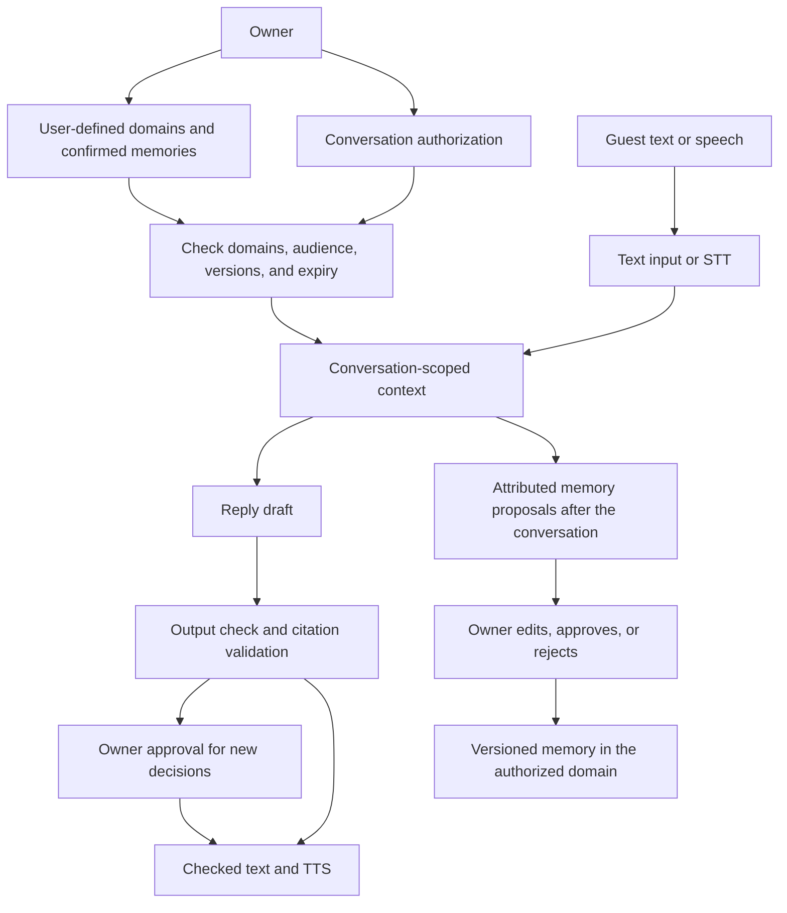

# Architecture and information boundaries

## Product model

A domain is a user-managed data object. Each workspace starts with an ordinary `default` domain, and each source, memory, and proposed update belongs to one domain. Quick chats read and propose updates within `default`. Users may explicitly choose other domains, or disable memory by selecting none. Automatic proposals use one destination domain and require owner review. A discussion scoped to a single project reads and writes only that domain.

## Four permissions

| Permission | Current implementation |
| --- | --- |
| read | Valid memories in `default` for quick chats, or individually selected memories in explicitly enabled domains |
| disclose | A subset of read, marked shareable and matching the audience; **the delegated reply model receives only this subset** |
| act | `ask`: new commitments await owner approval; `none`: share information without accepting decisions |
| write | One selected domain and a separate learning switch; only proposes updates until the owner approves them |

Private information selected for read but not disclose never enters the public reply model. This release does not implement a separate internal decision agent that reasons over a private reservation price. Read permission alone does not expose that price to the public model. An audience is an owner-defined authorization label, not a verified organization identity. Invitations are bearer credentials and should be delivered to the intended person.

Domains, selected memories, audience, destination domain, and action policy are fixed when a conversation is created. Delegations also have a fixed authorization expiry; private chats have no time-based expiry (`expires_at = null`) and retain their transcript for later continuation. Startup migration clears legacy private-chat deadlines without reopening ended or revoked conversations. The authorization snapshots memory versions. Editing a selected memory or domain revokes active conversations using it. Delegation expiry, selected-memory expiry, deletion, and revocation also stop replies and playback. Changing domains starts a new conversation with an empty transcript; the previous chat remains in history. A private chat cannot be converted into a delegation.

## Code responsibilities

| File | Responsibility |
| --- | --- |
| `database.py` | Persistent tables, owner-scoped repository, PostgreSQL RLS |
| `auth.py` | Password verification, hashed credentials, one-time invitations, expiry, revocation |
| `contracts.py` | Strict input validation; rejects additional authority fields |
| `service.py` | Domain, memory, authorization, reply, approval, learning, and deletion rules |
| `intelligence.py` | Retrieval within authorized facts, model calls, draft checking, read-only extraction |
| `rooms.py` | WebSocket identity revalidation, STT, interruption, checked speech output |
| `ingestion.py` | Bounded file-to-text extraction without automatic remote fetching |
| `app.py` | HTTP and WebSocket routes, same-origin restrictions, static interface |
| `web/app.js`, `web/voice.js` | Owner and guest interfaces, explicit recording and playback |

All browser paths share the Service permission checks. Models have no database connection, dynamic SQL, arbitrary domain query, filesystem access, or external side-effect tools. They return structured proposals and cannot grant authority.

## Identity and storage isolation

- This release is a single-owner deployment. Registration closes after initial setup. Tables still have owner_id, and repository queries always use the authenticated owner.
- Owner and guest use separate HttpOnly, SameSite=Strict cookies. Only SHA-256 hashes of random tokens are stored. Passwords use scrypt. Invitation tokens arrive in a URL fragment, which is removed on page load; redemption atomically consumes the original token.
- A guest credential is bound to one conversation. It does not grant owner APIs, domain lists, private notes, authorization details, or other rooms. Issuing another invitation invalidates previous guest credentials.
- PostgreSQL application-data transactions switch to the `echooo_scoped` role, which has no login or BYPASSRLS privilege. RLS restricts reads and writes using the trusted owner scope. SQLite relies on repository and service checks.
- RLS is currently **owner-level**; domain and disclosure restrictions are explicit Service checks. Initialization and authentication connections retain elevated privileges. Database administrators, server administrators, and a fully compromised application process are outside this boundary. Production hardening requires separate migration and runtime accounts.
- Mutating HTTP requests and WebSocket connections check origins. Responses prohibit caching and set a CSP. There is no cross-site CORS interface. Non-browser API clients may omit Origin but still require valid credentials.

## Reply path

1. Revalidate the caller credential and active authorization on both HTTP and WebSocket paths.
2. Load only valid facts selected for this conversation. Delegated replies use disclose; private replies use read. Private supervision notes are excluded.
3. Rank within the authorized set by lexical relevance. Live models receive at most 12 memories, totaling approximately 36,000 characters, plus the latest 12 messages from this conversation. Additional authorized candidates without exact lexical overlap are retained within that budget so the model can interpret paraphrases. **There is no vector index or cross-domain semantic search yet.**
4. Generate a JSON draft and validate its structure and citations. Delegated replies also call a checker. A denied check, invalid structure, unknown citation, or provider failure produces a limited fallback, without provider errors, keys, or request context.
5. Route new commitments to owner approval using a one-time state update. The owner supplies the exact message authorized for the guest.
6. Revalidate authorization and caller credentials after generation to catch expiry, revocation, or invitation rotation during the model call.
7. Publish only checked text, then play it. Interruption cancels the current generation or synthesis. Active connections also revalidate periodically and before sending audio chunks.

Database and input-context scope restrictions are deterministic. Model attribution, implicit commitment detection, and output checks can be wrong; this is not a guarantee of zero disclosure. Information volunteered by participants, entered in a conversation goal, or explicitly included in an approval may enter the conversation context. The goal field therefore asks users not to include secrets, while private supervision notes are stored separately.

## Learning and corrections

Files are first stored as domain-bound sources. Extraction creates pending proposals only. Conversation learning runs after a normal ending and includes speaker attribution and evidence IDs. Revoked conversations do not automatically produce memories. Private supervision notes and the assistant's own replies are not evidence for new memories. A client's request retains its attribution instead of becoming the owner's commitment.

On approval, the owner may edit the title, content, disclosure setting, audience, and expiry, then add or replace a memory. New memories default to private. Replacements validate the destination domain and expected_version. A version mismatch returns a conflict rather than silently overwriting changes. Earlier versions retain provenance and evidence; restoring earlier content creates a new version.

## Deletion and traceability

Deleting a domain removes its sources, memories, versions, proposals, and conversations using that domain, including messages and approvals. Deleting a source or memory also removes conversations that read it. Deletion follows memories derived from those conversations and their historical versions, preventing retrievable copies from surviving deletion of their source. Mixed-domain conversations and derived memories may therefore be removed together, even if a derived memory was saved in another domain.

This is application-level deletion propagation. Already heard, captured, or exported information cannot be recalled. Database WAL, backups, and provider-retained data need separate lifecycle policies; see Operations. Audit records support local traceability and are not tamper-proof legal evidence. Legacy conversation review provides attributed statements and decisions; the separate meeting mode provides draft chapter summaries and structured findings.

## Meeting capture and evidence

`meetings.py` registers a separate owner-only HTTP and WebSocket surface. Meetings
do not change private/delegated conversation permissions or inherit domain memories.
Project meetings can explicitly select versioned shareable memories through a separate
meeting disclosure grant; no default-domain or private-chat authorization is inherited.
See [Project meetings](PROJECT_MEETINGS.md) for retrieval, citations and reviewed updates.
New owned tables hold meetings, recording metadata, binary PCM parts, utterances,
versioned analysis sections, and recording-level rolling overviews. Foreign keys cascade meeting deletion through all
audio and derived records. The existing owner RLS installer includes these tables.

One browser microphone recorder is allowed per meeting per process. PCM frames are
committed before acknowledgment and STT forwarding. Recording-local sample offsets
anchor playback; provider word offsets are preferred when available. AssemblyAI
speaker labels are enabled only for meetings and remain recording-local hypotheses.
Real names require human correction. Capture does not invoke the chat reply/TTS path.

The browser requests recording-scoped incremental text analysis every minute and
after pause. `/chapters` processes one section: up to twelve new passages, bounded to 6,000
characters, plus preceding context bounded to 2,000 characters. Only utterance IDs,
speaker labels and recognized text enter the model; recordings are never inputs.
Each model call has a 40-second total deadline. Completed chapters return immediately;
the browser continues until the text present at the start of the request is covered.
Failures preserve completed chapters and expose safe, actionable error categories.
The separate `/summarize` endpoint updates one recording overview without creating
sections. It folds up to forty new passages / 6,000 characters into the previous
overview, tracking covered evidence IDs and the transcript revision. The browser
continues bounded requests until the initial text snapshot is covered. Overview
generation is lossy model summarization, not a replacement for the stored original
transcript. Both endpoints accept a validated recording scope; notes have their
own scope. The UI filters summaries, findings and transcript to the selected
recording and keeps the full original text available independently of chapters.
Findings have validated evidence IDs, but entailment and conflict detection remain
model judgments; all sections start pending. Human review confirms/rejects a section.
Knowledge is a first-class optional finding kind for KT/informational meetings.
The extraction prompt distinguishes existing explanations from adopted decisions
and unanswered questions from answered teaching Q&A. New question findings require
an explicit `resolution="unresolved"`; absent/answered classifications are filtered.
This is an output contract, not a factual verifier or cross-chapter reconciliation.
The UI renders only populated categories. Review lives in an optional disclosure:
marking accurate checks AI output, not meeting consensus; exclusion hides findings
while retaining the section and source. Existing saved analysis is not rewritten.
The recording reader has a sticky in-page navigator and a fixed audio dock with
measured scroll clearance. Audio time updates highlight existing sentence nodes;
they do not re-render the transcript. Playback following is opt-in and independent
of live-capture following. Literal search is scoped to the current recording,
preserves complete paragraphs and original evidence IDs, and escapes displayed
text. Native paragraph and sentence-detail disclosures retain their open state.
Transcript corrections increment the meeting revision and mark earlier analysis
stale. Re-analysis appends fresh sections and preserves old sections for history.
No meeting analysis is automatically published, executed, or saved as domain memory.
Individual recording deletion cascades audio and utterances, removes sections and
overviews derived from that recording, and preserves unrelated recordings. It is
blocked during active capture or analysis. Confirmed exports and backups remain
outside this application-level deletion boundary.

Audio downloads are authenticated WAV responses with byte ranges. Binary parts are
excluded from JSON export; the interface offers separate WAV downloads. This MVP
stores audio in the database and assembles one recording in memory for playback,
bounded to 30 minutes per recording. It requires one application worker and an open
capture page. Object storage, multi-track/platform capture, cross-meeting retrieval,
durable background analysis, and long-meeting global conflict reconciliation remain
future work. Microphone processing and resampling apply to the stored PCM signal.

## Language, speech, and deployment boundaries

The interface, application-owned notices, and documentation default to English. Stored user content is not translated or rewritten. Live model prompts continue to follow the latest message language; browser speech chooses a matching voice for English or Chinese text. Chinese recognition patterns and literal provider speaker IDs are retained for compatibility.

The current media layer uses a PCM WebSocket connection between the browser and FastAPI. STT, LLM, and TTS remain replaceable. Using AssemblyAI for STT keeps personal data and authority orchestration independent of the speech service. Browser synthesis prefers a local device voice, but the device may use cloud speech; a private CosyVoice service provides explicit control over the synthesis location.

This release has no LiveKit, multiple participant tracks, or meeting bot. First validate a single guest's authorized conversation, then connect the same Service to WebRTC or LiveKit. Broadcasts, cancellation tasks, and locks live in one process, so deployment requires one worker. The transcript records the full published text; it does not prove that a participant heard every audio segment. Exact played-text accounting after interruption remains a future acceptance item.

## Global private-chat entry

The home page, sidebar, and conversation list share an immediate private-chat
entry, `POST /api/sessions/quick-chat`. The server resolves or creates the owner's
`default` domain and snapshots its confirmed, unexpired memories in the same
transaction as session creation. Only that domain is authorized for reads and
end-of-chat proposals; disclosure remains empty. It uses the normal authenticated
text and voice paths, version checks, and owner review. Neither other domains nor
previous transcripts are inherited.

Initial setup creates `default` atomically with the owner. Startup also provisions
existing owners with no domains. The ordinary domain CRUD rules still apply; a
renamed or deleted `default` is replaced by a fresh empty domain on the next quick
chat. An existing domain named `default` is reused without changing its content.
Explicit custom sessions can still set empty `domain_ids` and `read_ids`, with
`write_domain_id=null` and `allow_learning=false`, to disable personal memory.

The owner can explicitly save one of their own messages through
`POST /api/sessions/{id}/memory-proposals`, supplying a destination, title, and
content. This creates a pending proposal with the original message as evidence.
It cannot copy assistant messages, another conversation's messages, or another
owner's domain. Scoped chats only allow destinations in their selected domains;
a general chat can target any domain the owner explicitly chooses. Creating the
proposal does not change the chat's permissions. Manual proposals do not prevent
normal end-of-chat extraction in sessions where it was separately enabled.

## Project meeting boundaries

The personally managed bot serves the public meeting discussion. Meeting knowledge
grants select confirmed shareable memories with no audience restriction. The main
project is immutable after participation or capture starts. References are read-only
inputs; reviewed updates can write only to the main project. Public generation checks
source membership and revalidates the scope after generation and during playback.
Private bot chat never authenticates an owner or enters project-memory extraction.
Owner-only extraction compares meeting evidence with project memories and creates
reviewable proposals. Evidence fingerprints and expected target versions guard approval.
Deleting source meeting evidence purges linked drafts and reviewed derivatives.
